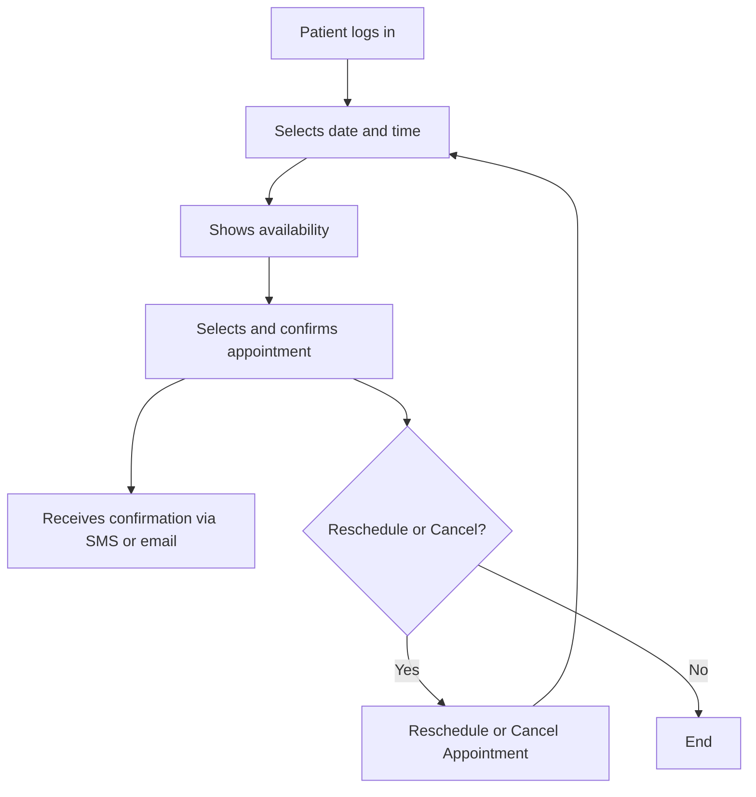

```mermaid
flowchart TD
    A[Patient logs in] --> B[Selects date and time]
    B --> C[Shows availability]
    C --> D[Selects and confirms appointment]
    D --> E[Receives confirmation via SMS or email]
    D --> F{Reschedule or Cancel?}
    F -- Yes --> G[Reschedule or Cancel Appointment]
    G --> B
    F -- No --> H[End]
```
