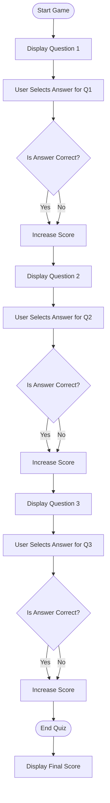

```mermaid
flowchart TD
    Start([Start Game]) --> Q1[Display Question 1]
    Q1 --> A1[User Selects Answer for Q1]
    A1 --> CheckA1{Is Answer Correct?}
    CheckA1 -- Yes --> Score1[Increase Score]
    CheckA1 -- No --> Score1
    Score1 --> Q2[Display Question 2]
    Q2 --> A2[User Selects Answer for Q2]
    A2 --> CheckA2{Is Answer Correct?}
    CheckA2 -- Yes --> Score2[Increase Score]
    CheckA2 -- No --> Score2
    Score2 --> Q3[Display Question 3]
    Q3 --> A3[User Selects Answer for Q3]
    A3 --> CheckA3{Is Answer Correct?}
    CheckA3 -- Yes --> Score3[Increase Score]
    CheckA3 -- No --> Score3
    Score3 --> EndQuiz([End Quiz])
    EndQuiz --> ShowScore[Display Final Score]
```
